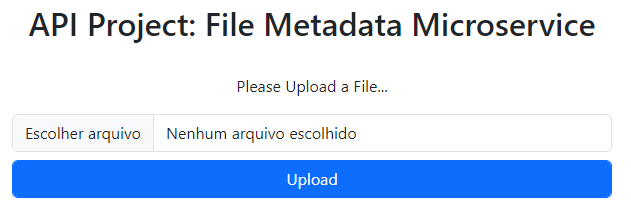

# File Metadata Microservice

- This API allows the upload of files to see their metadata.

- Since this is a backend pactice, the interface is just for testing and provided by FreeCodeCamp.

Technologies used: Javascript, NodeJS

# Live Version

https://file-metadata.lorenzo-lipp.repl.co/



# Running Locally

To run this locally, run the following commands in a terminal:

```
npm install
npm start
```

# Requirements

- You can submit a form that includes a file upload.
- The form file input field has the name attribute set to upfile.
- When you submit a file, you receive the file name, type, and size in bytes within the JSON response.