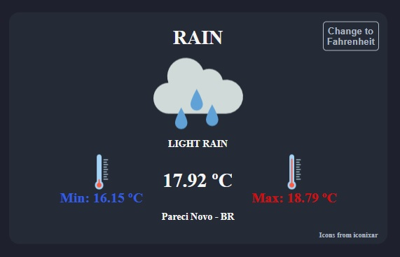

# Local Weather

- This React application consumes an API to show user's local wheater

Technologies used: CSS, Javascript, React

# Live Version

https://local-wheater.lorenzo-lipp.repl.co/



# Running Locally

To run this locally, run the following commands in a terminal:

```
npm install
npm run dev
```

# Requirements

- I can see the weather in my current location.
- I can see a different icon or background image (e.g. snowy mountain, hot desert) depending on the weather.
- I can push a button to toggle between Fahrenheit and Celsius.