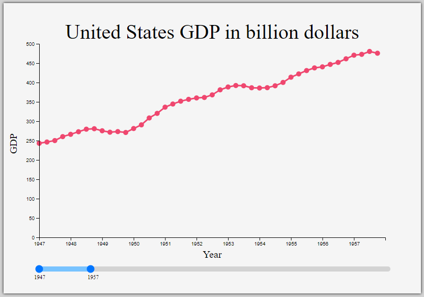

# Free Code Camp Projects

This repository contains projects that I did while taking the freecodecamp courses and related projects.

## Exercise Tracker

- This API allows the creating of users and keeping track of exercises assigned to users.

- The interface, made by freecodecamp, is simple and intended just for testing.

Technologies used: Javascript, NodeJS, MongoDB, Mongoose

Link to the project: https://exercise-tracker.lorenzo-lipp.repl.co/

## File Metadata

- This API allows the upload of files to see their metadata.

- The interface, made by freecodecamp, is simple and intended just for testing.

Technologies used: Javascript, NodeJS

Link to the project: https://file-metadata.lorenzo-lipp.repl.co/

## Header Parser

- This API allows getting user browser information.

- The interface, made by freecodecamp, is simple and intended just for testing.

Technologies used: Javascript, NodeJS

Link to the project: https://header-parser.lorenzo-lipp.repl.co/

## Library

- This API allows you to review and post books.

Technologies used: CSS, Javascript, NodeJS, React, MongoDB, Mongoose

Link to the project: https://library.lorenzo-lipp.repl.co/

## Sudoku

- This API allows you to get a new sudoku game every refresh.

- The React interface is responsible and has all the features to play the game, marking numbers that aren't part of the solution.

Technologies used: CSS, Javascript, NodeJS, React

Link to the project: https://sudoku.lorenzo-lipp.repl.co/

## Timestamp

- This API allows to get dates in UTC and unix.

- The interface, made by freecodecamp, is simple and intended just for testing.

Technologies used: Javascript, NodeJS

Link to the project: https://timestamp.lorenzo-lipp.repl.co/

## URL Shortener

- This API allows shortening URLs.

- The interface, made by freecodecamp, is simple and intended just for testing.

Technologies used: Javascript, NodeJS, MongoDB, Mongoose

Link to the project: https://url-shortener.lorenzo-lipp.repl.co/

## Demographic Data Analyzer

- This python script analyzes data from a CSV file.

Technologies used: Python, Pandas

Link to the project: https://replit.com/@lorenzo-lipp/Demographic-Data-Analyzer

## Mean Variance Standard Deviation Calculator

- This python script calculates the sum, variance, standard deviation, max, min, and mean along both axes of a 3x3 matrix and for the flattened matrix.

Technologies used: Python, Numpy

Link to the project: https://colab.research.google.com/drive/1HFZ-B3R6B9UpO7xHyieWmCBYH-u4fyd8?usp=sharing

## Medical Data Visualizer

- This python script plots a heatmap and a bar chart using data from a CSV file.

Technologies used: Python, Numpy, Pandas,Matplotlib

Link to the project: https://replit.com/@lorenzo-lipp/boilerplate-medical-data-visualizer

## Page View Time Series Visualizer

- This python script plots a line chart, a bar chart, and a box plot using data from a CSV file.

Technologies used: Python, Numpy, Pandas, Matplotlib, Seaborn

Link to the project: https://replit.com/@lorenzo-lipp/Page-View-Time-Series-Visualizer

## Sea Level Predictor

- This python script plots a graphic predicting the sea level using data from a CSV file.

Technologies used: Python, Numpy, Pandas, Matplotlib

Link to the project: https://replit.com/@lorenzo-lipp/Sea-Level-Predictor

## 25 + 5 Clock

- This React application implements a 25 + 5 clock (Pomodoro timer).

Technologies used: CSS, Javascript, React

Link to the project: https://25-5-clock.lorenzo-lipp.repl.co/

## Drum Pad

- This React application emulates a drum pad.

Technologies used: CSS, Javascript, React

Link to the project: https://drum-pad.lorenzo-lipp.repl.co/

## Javascript Calculator

- This React application emulates a calculator.

Technologies used: CSS, Javascript, React

Link to the project: https://javascript-calculator.lorenzo-lipp.repl.co/

## Local Wheater

- This React application consumes an API to show user's local wheater

Technologies used: CSS, Javascript, React

Link to the project: https://local-wheater.lorenzo-lipp.repl.co/

## Markdown Previewer

- This React application renders a page using markdown text as input.

Technologies used: CSS, Javascript, React

Link to the project: https://markdown-previewer.lorenzo-lipp.repl.co/

## Random Quote Machine

- This jQuery application fetches an API and gets random quotes, displaying them to the user.

Technologies used: HTML, CSS, Javascript, jQuery, Bootstrap

Link to the project: https://random-quote-machine.lorenzo-lipp.repl.co/

## Wikipedia Viewer

- This React application allows searching Wikipedia articles.

Technologies used: CSS, Javascript, React

Link to the project: https://wikipedia-viewer.lorenzo-lipp.repl.co/

## Message Board

- This API allows you to post messages, create threads, and reply to messages.

- The interface, made by freecodecamp, is simple and intended just for testing.

Technologies used: Javascript, NodeJS, HelmetJS

Link to the project: https://message-board.lorenzo-lipp.repl.co

## Port Scanner

- This python script allows you to scan for unintended open ports on your service, which can become vulnerabilities.

Technologies used: Python

Link to the project: https://colab.research.google.com/drive/1s6t-1xjdoDBC5u2Ul6gPCMxUwplJEz0P?usp=sharing

## Real Time Multiplayer Game

- This web socket application allows playing a multiplayer game with whoever connects to the server.

Technologies used: Javascript, NodeJS, HelmetJS

Link to the project: https://real-time-multiplayer-game.lorenzo-lipp.repl.co/

## SHA-1 Password Cracker

- This python script cracks passwords encrypted with SHA-1.

Technologies used: Python, Hashlib

Link to the project: https://replit.com/@lorenzo-lipp/SHA-1-Password-Cracker

## Stock Checker

- This API allows you to get data from stock prices.

- The interface, made by freecodecamp, is simple and intended just for testing.

Technologies used: Javascript, NodeJS

Link to the project: https://stock-checker.lorenzo-lipp.repl.co

## American to British Translator

- This node application allows you to translate American to British and vice versa.

- The interface, made by freecodecamp, is simple and intended just for testing.

Technologies used: Javascript, NodeJS, ChaiJS

Link to the project: https://american-british-english-translator.lorenzo-lipp.repl.co/

## Issue Tracker

- This API allows you to create, update and delete issues.

- The interface, made by freecodecamp, is simple and intended just for testing.

Technologies used: JavaScript, NodeJS, ChaiJS, MongoDB, Mongoose

Link to the project: https://issue-tracker.lorenzo-lipp.repl.co/

## Library

- This API allows you to insert new books, comment on books and get the books list.

- The interface, made by freecodecamp, is simple and intended just for testing. 

- You can see it with a better interface at: https://library.lorenzo-lipp.repl.co/

Technologies used: JavaScript, NodeJS, ChaiJS, MongoDB, Mongoose

Link to the project: https://personal-library.lorenzo-lipp.repl.co

## Metric-Imperial Converter

- This API converts from the metric system to the imperial system and vice versa.

- The interface, made by freecodecamp, is simple and intended just for testing. 

Technologies used: Javascript, NodeJS, ChaiJS

Link to the project: https://metric-imperial-converter.lorenzo-lipp.repl.co/

## Sudoku Solver

- This API receives as input a string with 81 digits (or ".") and solves the sudoku game by filling dots with numbers following sudoku rules.

- The interface, made by freecodecamp, is simple and intended just for testing. 

- You can see it with a better interface at: https://sudoku.lorenzo-lipp.repl.co/

Technologies used: Javascript, NodeJS, ChaiJS

Link to the project: https://sudoku-solver.lorenzo-lipp.repl.co/

## Celestial Bodies Database

- This Celestial Bodies database was built using PostgreSQL.

Technologies used: PostgreSQL

## Number Guessing Game

- This shell script implements a Number Guessing game and saves user progress to a PostgreSQL database.

Technologies used: PostgreSQL, Shell Script

## Periodic Table Database

- This Celestial Bodies database was built using PostgreSQL and a shell script to display information.

Technologies used: PostgreSQL, Shell Script

## Salon Appointment Scheduler

- This shell script emulates an appointment scheduler and saves information to a PostgreSQL database.

Technologies used: PostgreSQL, Shell Script

## World Cup Database

- This World Cup database was built using a shell script to insert data from a CSV file into a PostgreSQL database.

Technologies used: PostgreSQL, Shell Script

## Personal Portfolio

- This is a responsive web design of a personal portfolio webpage. 

Technologies used: HTML, CSS, Javascript

Link to the project: https://portfolio-page.lorenzo-lipp.repl.co/

## Product Landing Page

- This is a responsive web design of a product landing webpage.

Technologies used: HTML, CSS, Javascript

Link to the project: https://product-landing-page.lorenzo-lipp.repl.co/

## Survey Form

- This is a responsive web design of a survey form webpage.

Technologies used: HTML, CSS, Javascript

Link to the project: https://survey-form.lorenzo-lipp.repl.co/

## Technical Documentation Page

- This is a responsive web design of a technical documentation webpage.

Technologies used: HTML, CSS, Javascript

Link to the project: https://technical-documentation-page.lorenzo-lipp.repl.co/

## Tribute Page

- This is a responsive web design of a tribute webpage.

Technologies used: HTML, CSS, Javascript

Link to the project: https://tribute-page.lorenzo-lipp.repl.co/

## Arithmetic Formatter

- This python script formats arithmetic operations into a more human-readable format.

Technologies used: Python

Link to the project: https://colab.research.google.com/drive/1-z9gFkLNqbgyoJwcJ2IjPB2U6CUmcwkJ?usp=sharing

## Budget App

- This python script implements a budget app that keeps track of monetary movements.

Technologies used: Python

Link to the project: https://colab.research.google.com/drive/1MVezhefk-fTfNhqnFYxdprCVzcOPz4XV?usp=sharing

## Polygon Area Calculator

- This python script allows you to calculate a rectangle's area and perimeter.

Technologies used: Python

Link to the project: https://colab.research.google.com/drive/1KD79LZ8xVFq69teX2Kj8-AYk1wZjI_Cw?usp=sharing

## Probability Calculator

- This python script allows you to calculate the probability of getting balls from a hat.

Technologies used: Python

Link to the project: https://colab.research.google.com/drive/1-p7n5AjamMAvS1s5JQQ1l-EK6e6YCnzP?usp=sharing

## Time Calculator

- This python script allows you to calculate time using a 12-hour clock (AM/PM).

Technologies used: Python

Link to the project: https://colab.research.google.com/drive/15g6LSgovY67nepzV4-QKM5x47k-qxuTx?usp=sharing

## Bar Chart

- This D3 graph allows you to visualize data with a bar chart.

Technologies used: Javascript, D3

Link to the project: https://bar-chart.lorenzo-lipp.repl.co/

## Choropleth Map

- This D3 graph allows you to visualize data with a choropleth map.

Technologies used: Javascript, D3

Link to the project: https://choropleth-map.lorenzo-lipp.repl.co/

## Doughnut Chart

- This ChartJS graph allows you to visualize data with a doughnut chart.

Technologies used: Javascript, ChartJS

Link to the project: https://doughnut-chart.lorenzo-lipp.repl.co/

## Heat Map

- This D3 graph allows you to visualize data with a heat map.

Technologies used: Javascript, D3

Link to the project: https://heat-map.lorenzo-lipp.repl.co

## Line Chart

- This D3 graph allows you to visualize data with a line chart.

Technologies used: Javascript, D3

Link to the project: https://line-chart.lorenzo-lipp.repl.co/

## Multiline Chart

- This D3 graph allows you to visualize data with a multiline chart.

Technologies used: Javascript, D3

Link to the project: https://multiline-chart.lorenzo-lipp.repl.co/

## Population Pyramid

- This D3 graph allows you to visualize data with a population pyramid.

Technologies used: Javascript, D3

Link to the project: https://population-pyramid.lorenzo-lipp.repl.co/

## Radar Chart

- This ChartJS graph allows you to visualize data with a radar chart.

Technologies used: Javascript, ChartJS

Link to the project: https://radar-chart.lorenzo-lipp.repl.co/

## Scatterplot Graph

- This D3 graph allows you to visualize data with a scatterplot graph.

Technologies used: Javascript, D3

Link to the project: https://scatterplot-graph.lorenzo-lipp.repl.co/

## Treemap Diagram

- This D3 graph allows you to visualize data with a treemap diagram.

Technologies used: Javascript, D3

Link to the project: https://treemap-diagram.lorenzo-lipp.repl.co/

