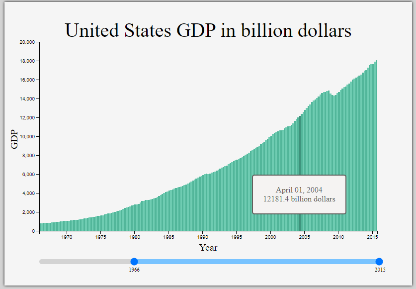
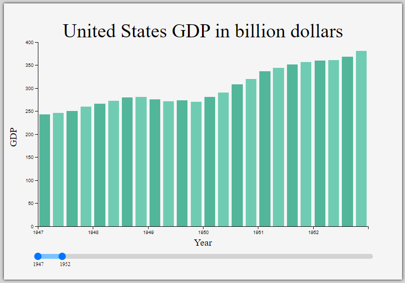

# Visualize Data with a Bar Chart

- This D3 graph allows you to visualize data with a bar chart.

Technologies used: Javascript, D3

# Live Version

https://bar-chart.lorenzo-lipp.repl.co/

# Requirements

- My chart should have a title with a corresponding id="title".
- My chart should have a g element x-axis with a corresponding id="x-axis".
- My chart should have a g element y-axis with a corresponding id="y-axis".
- Both axes should contain multiple tick labels, each with a corresponding class="tick".
- My chart should have a rect element for each data point with a corresponding class="bar" displaying the data.
- Each .bar should have the properties data-date and data-gdp containing date and GDP values.
- The .bar elements' data-date properties should match the order of the provided data.
- The .bar elements' data-gdp properties should match the order of the provided data.
- Each .bar element's height should accurately represent the data's corresponding GDP.
- The data-date attribute and its corresponding .bar element should align with the corresponding value on the x-axis.
- The data-gdp attribute and its corresponding .bar element should align with the corresponding value on the y-axis.
- I can mouse over an area and see a tooltip with a corresponding id="tooltip" which displays more information about the area.
- My tooltip should have a data-date property that corresponds to the data-date of the active area.