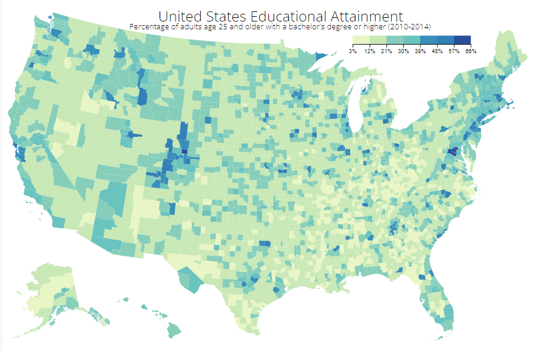
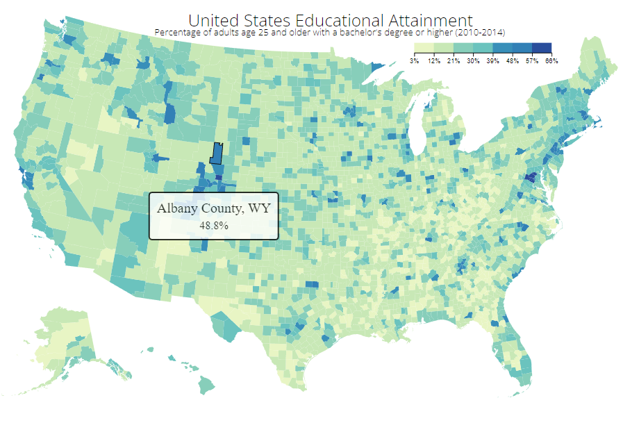

# Visualize Data with a Choropleth Map

- This D3 graph allows you to visualize data with a choropleth map.

Technologies used: Javascript, D3

# Live Version

https://choropleth-map.lorenzo-lipp.repl.co/

# Requirements

- My choropleth should have a title with a corresponding id="title".
- My choropleth should have a description element with a corresponding id="description".
- My choropleth should have counties with a corresponding class="county" that represent the data.
- There should be at least 4 different fill colors used for the counties.
- My counties should each have data-fips and data-education properties containing their corresponding fips and education values.
- My choropleth should have a county for each provided data point.
- The counties should have data-fips and data-education values that match the sample data.
- My choropleth should have a legend with a corresponding id="legend".
- There should be at least 4 different fill colors used for the legend.
- I can mouse over an area and see a tooltip with a corresponding id="tooltip" which displays more information about the area.
- My tooltip should have a data-education property that corresponds to the data-education of the active area.