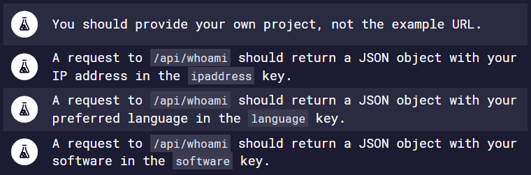

# Request Header Parser Microservice

Project based on: https://www.freecodecamp.org/learn/apis-and-microservices/apis-and-microservices-projects/request-header-parser-microservice

# Live Version

https://header-parser.lorenzo-lipp.repl.co/

# Requirements

