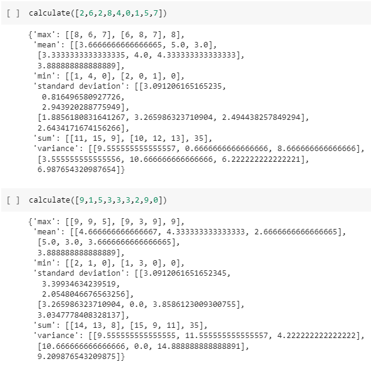

# Mean-Variance-Standard Deviation Calculator

Project based on: https://www.freecodecamp.org/learn/data-analysis-with-python/data-analysis-with-python-projects/mean-variance-standard-deviation-calculator

# Live Version

https://colab.research.google.com/drive/1HFZ-B3R6B9UpO7xHyieWmCBYH-u4fyd8?usp=sharing

# Requirements

