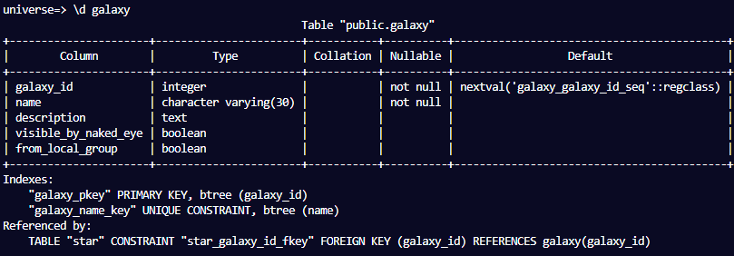
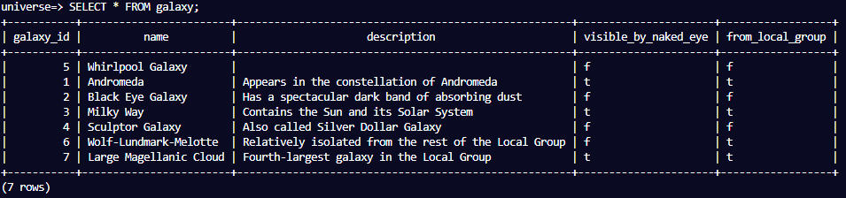
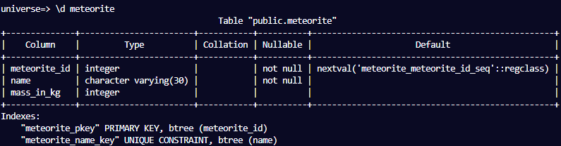
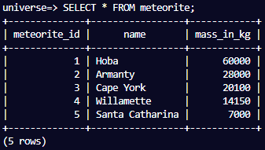
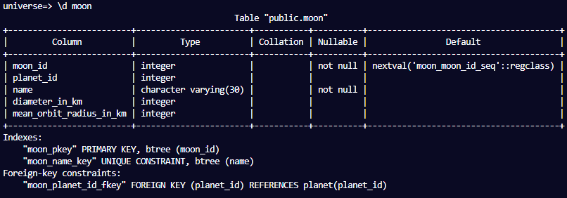
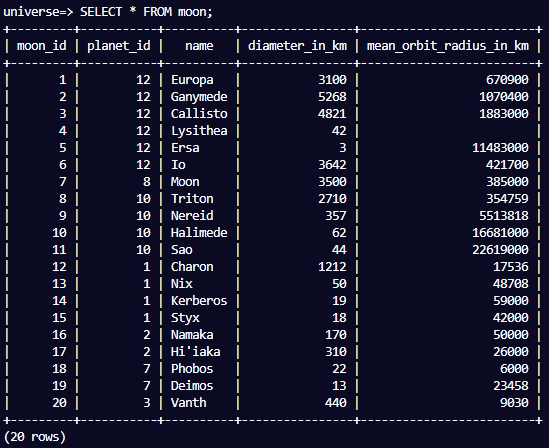
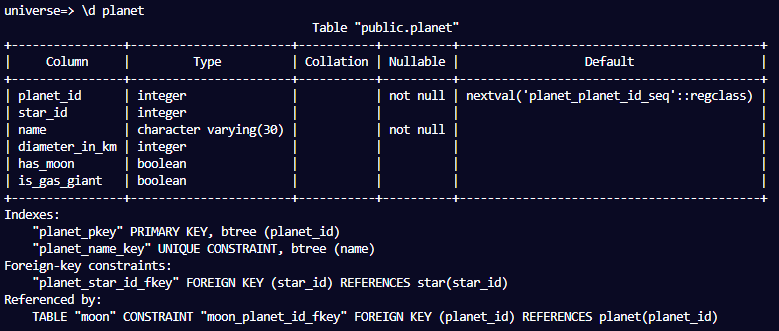
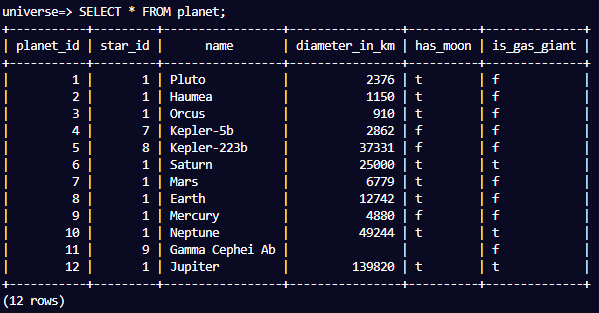
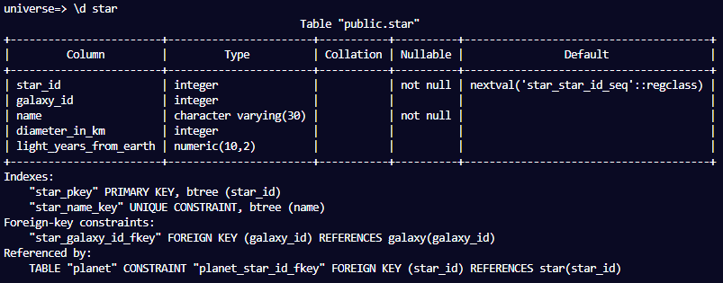
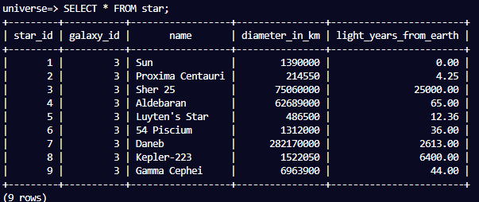

# Celestial Bodies Database

Project based on: https://www.freecodecamp.org/learn/relational-database/build-a-celestial-bodies-database-project/build-a-celestial-bodies-database

# Live Version Output

# Requirements

