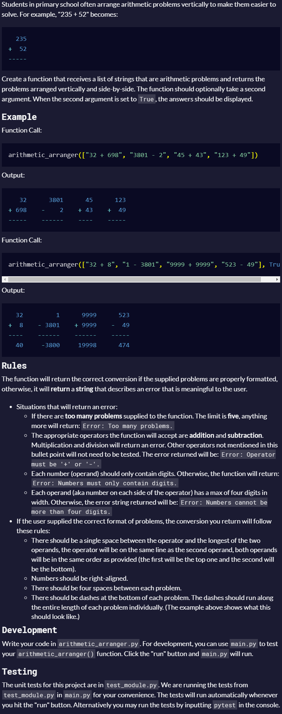

# Arithmetic Formatter

Project based on: https://www.freecodecamp.org/learn/scientific-computing-with-python/scientific-computing-with-python-projects/arithmetic-formatter

# Live Version

https://colab.research.google.com/drive/1-z9gFkLNqbgyoJwcJ2IjPB2U6CUmcwkJ?usp=sharing

# Requirements

