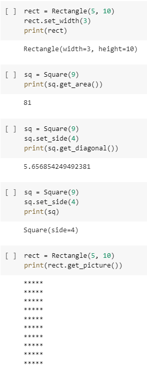

# Polygon Area Calculator

Project based on: https://www.freecodecamp.org/learn/scientific-computing-with-python/scientific-computing-with-python-projects/polygon-area-calculator

# Live Version

https://colab.research.google.com/drive/1KD79LZ8xVFq69teX2Kj8-AYk1wZjI_Cw?usp=sharing

# Requirements

