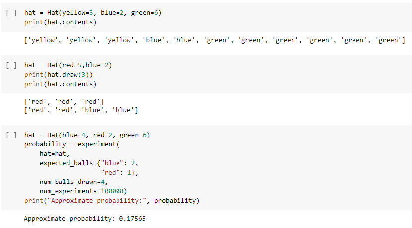

# Probability Calculator

Project based on: https://www.freecodecamp.org/learn/scientific-computing-with-python/scientific-computing-with-python-projects/probability-calculator

# Live Version

https://colab.research.google.com/drive/1-p7n5AjamMAvS1s5JQQ1l-EK6e6YCnzP?usp=sharing

# Requirements

