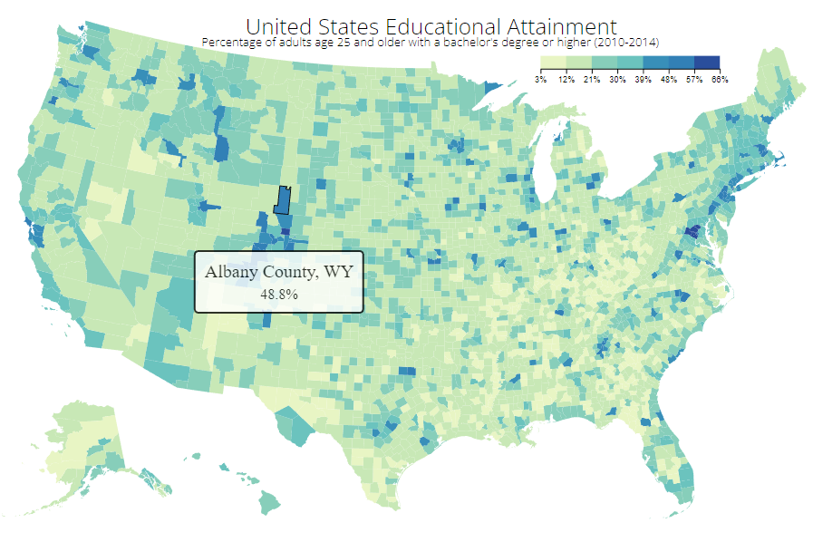

# Visualize Data with a Choropleth Map

Project based on: https://www.freecodecamp.org/learn/data-visualization/data-visualization-projects/visualize-data-with-a-choropleth-map

# Live Version

https://choropleth-map.lorenzo-lipp.repl.co/

# Requirements

